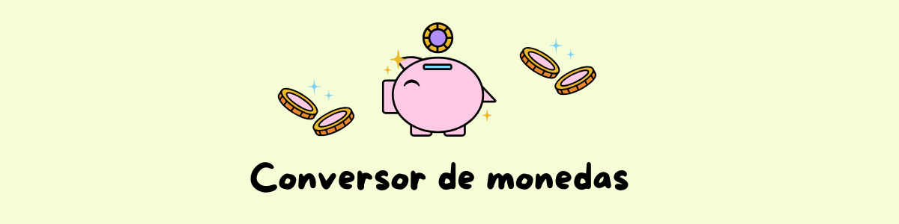

  

  
  
  

# 📘 Descripción del proyecto

Este es un proyecto de consola en Java que permite realizar conversiones entre monedas latinoamericanas utilizando datos reales de una API. El programa guarda un historial con fecha y hora, muestra nombres completos de monedas y gestiona errores de entrada de forma amigable.

# 🛠️ Tecnologías utilizadas

- ☕ Java (JDK 11+)
- 📦 Gson (para parsear JSON)
- 🌐 ExchangeRate-API
- 💻 Visual Studio Code

# ✨ Funcionalidades

- Menú interactivo por consola
- Conversión con tasa real obtenida desde la API
- Registro automático del historial en `historial.txt`
- Visualización del historial desde el programa
- Manejo de errores: opciones inválidas o entradas no numéricas
- Monedas mostradas con nombres completos (no solo siglas)

# ▶️ Cómo usar

1. Cloná este repositorio:  
   `git clone https://github.com/biachiuzano/conversordemonedas.git`

2. Abrí el proyecto en tu editor (recomendado: Visual Studio Code)

3. Ejecutá el archivo desde tu terminal:  
   `src/Conversor.java`

4. Seguí las instrucciones que aparecen en consola para seleccionar las monedas y convertir montos.

5. Las conversiones se guardarán automáticamente en el archivo `historial.txt`.

¡Listo! Ya podés convertir monedas de forma rápida y sencilla 💸

# 📁 Estructura del proyecto

 ConversorDeMonedas/

 ├── src/
 
 │ └── Conversor.java
 
 ├── lib/
 
 │ └── gson-2.13.1.jar
 
 ├── historial.txt
 
 ├── assets/
 
 │ ├── banner.png
 
 │ └── captura.png
 
 └── README.md
 

📌 El archivo `historial.txt` se genera automáticamente tras cada conversión válida.

# 👩🏻‍💻 Desarrolladora

  
   
  <b>Bianka Chiuzano</b> 
  Desarrolladora de software | Apasionada por la tecnología

# 📄 Licencia

Este proyecto fue desarrollado con fines educativos y es de libre uso.  
¡Podés compartirlo, modificarlo y seguir aprendiendo! ✨
